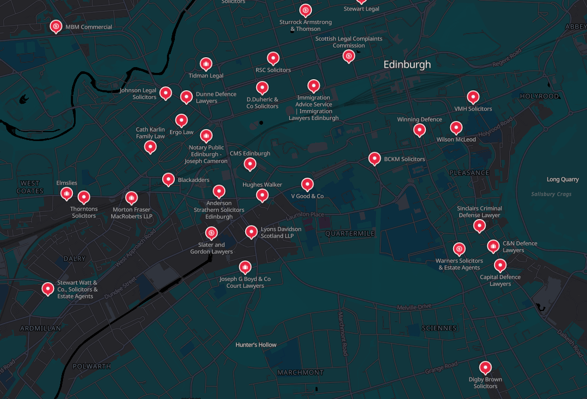
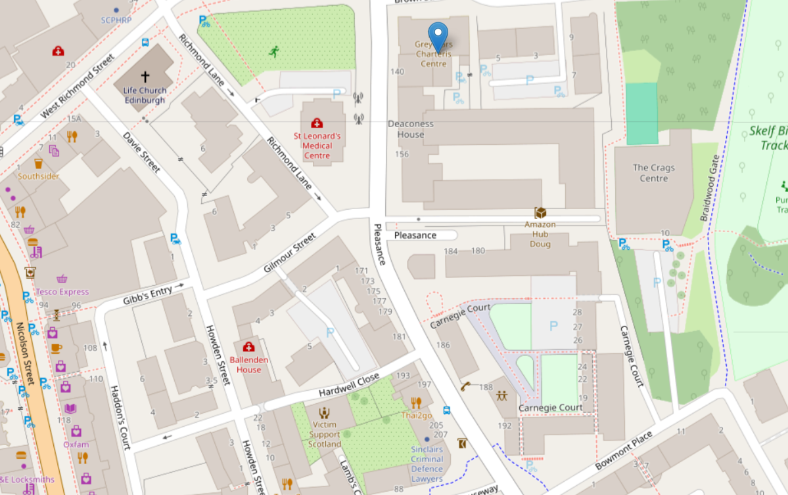
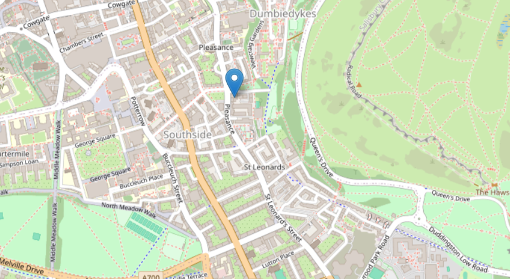
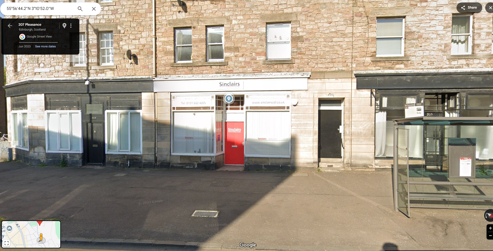

# ** Sonnets Secret **

We were given with a poem :-
In misty glens where thistles grow,
A tale of treachery, dark and low.
Where stone walls whisper ancient lore,
Of crowns that fell to rise no more.

Seek ye the place where rivers meet,
Where royal blood once stained the street.
A castle's shadow looms nearby,
Its secrets locked in mortar dry.

Not Elsinore, but kindred shame,
Where kinsmen plotted, took their aim.
The crown did fall, a nation reeled,
In Scotland's heart, the truth concealed.

Where cobbles echo footsteps past,
And ghosts of kings their shadows cast,
The answer lies, if you dare seek,
In halls where history doth speak.

Find where the old and new entwine,
Where modern glass meets ancient spine.
The murder's stage, now tourist's fare,
Reveals itself to those who dare.

Beneath the mist of ages gone,
A city's heart still beats on,
Where alleys twist and chimneys smoke,
And ancient stones their tales invoke.

Seek ye the place where justice dwells,
In chambers where the truth compels,
A door of crimson, walls of white,
Guard secrets of that fateful night.

Near where the deed was darkly done,
A guardian of rights has won,
His fortress stands, a beacon bright,
For those who'd challenge crown and might.

In shadows of the old town's reach,
Where history and present meet,
The answers to this riddle lie,
For those with keen and searching eye.

Not far from where the monarch fell,
A modern Portia casts his spell,
With crimson door and snowy wall,
He stands where justice casts its pall.

Defender of the accused and shamed,
This legal eagle, justly famed,
Near murder's ground, both old and new,
Awaits to give the devil his due.

A gentleman of law, not dame,
His office near the scene of shame,
Where ancient wrongs and modern plights,
Find voice in his impassioned fights.

His name, a regal echo strong,
Of kings who ruled when knights were young,
A Henry bold, with George before,
Defends where once a crown was wore.

Now seek the plate upon the door,
The final clue you're searching for,
What name is etched in letters clear?
The answer to our riddle dear.


## **1. Setting the Scene: A Royal Murder in Scotland**
The poem provided in the challenge hinted at a historical betrayal and murder in Scotland. Key clues included:
- References to **stone walls, castles, and ancient whispers**, suggesting a place with a deep historical past.
- The line:  
  > "Seek ye the place where rivers meet, Where royal blood once stained the street."
  
  This strongly indicated **a murder near a castle and a river in Scotland**.

## **2. The Murder Location: Edinburgh & Kirk o’ Field**
Further analysis of the poem led to these insights:
- **"Not Elsinore, but kindred shame."**  
  - **Elsinore** refers to the castle in *Hamlet*, which is famous for betrayal and murder.
  - This suggested a **similar betrayal in Scotland**.
- **"The crown did fall, a nation reeled, In Scotland’s heart, the truth concealed."**  
  - This hinted at **a royal figure's murder**, causing significant political consequences.

The strongest match to these clues was the **murder of Lord Darnley (Mary, Queen of Scots’ husband) at Kirk o’ Field, Edinburgh, in 1567**.
[wikipedia](https://en.wikipedia.org/wiki/Murder_of_Lord_Darnley)
## **3. A Modern Connection: A Lawyer Near This Historic Site**
The poem then transitioned to modern times:
- **"Find where the old and new entwine, Where modern glass meets ancient spine."**
  - This suggested a location in Edinburgh that **blends historical and modern architecture**.
- **"Seek ye the place where justice dwells, In chambers where the truth compels."**
  - This pointed towards **a location related to law or courts** (such as a law office or legal chambers).

## **4. Identifying a Lawyer with a Royal Name**
The poem further described:
- **"Defender of the accused and shamed, This legal eagle, justly famed."**
  - This hinted at **a prominent criminal defense lawyer**.
- **"His name, a regal echo strong, Of kings who ruled when knights were young."**
  - This suggested a **name associated with British royalty** (such as Henry, George).
- **"Now seek the plate upon the door, The final clue you're searching for."**
  - This meant that the answer would be **on the door of a law office near Kirk o’ Field**.

## **5. Finding the Lawyer and the Flag**

### **Using Google to Narrow Down the Search**
After identifying **Kirk o’ Field** as the historic site, I began searching for **lawyers in Edinburgh** near this location. I used search queries like:
- *"criminal defense lawyer Edinburgh near Kirk o’ Field"*
- *"law offices Edinburgh near Royal Mile"*


Among the search results, one firm stood out and was very close to the murder site:
- **Sinclairs Criminal Defence Lawyers**

### **Why "Sinclairs" Matched the Clues**
- The **Sinclair family** has noble Scottish origins, matching the poem’s hint about **a royal name**.
- Their office was **located near the site of Lord Darnley’s murder**, aligning with the historical connection in the challenge.

### **Verifying the Law Office’s Location**
Since the poem’s final lines instructed to find **the plate on the door**, I needed to confirm that the law firm had an actual **physical office near the murder site**.

#### **Using Google Maps & Street View**
1. I searched for **"Sinclairs Criminal Defence Lawyers Edinburgh"** on Google Maps.
2. The firm’s location was **in an area where historic and modern buildings merged**, matching the clue:
   > "Find where the old and new entwine, Where modern glass meets ancient spine."
3. Using **Google Street View**, I zoomed in on the office entrance.
4. I **confirmed that the firm’s name, "Sinclairs," was displayed on the doorplate**.

### **Screenshots as Evidence**
Below are the images that document the process:







## **6. Submitting the Flag**
Since all the clues aligned perfectly, I submitted:
```
BITSCTF{sinclairs}
```
And it was **correct**! 🎉

## **Final Thoughts**
This challenge required a combination of:
- **Historical knowledge** (Lord Darnley’s murder at Kirk o’ Field).
- **Lateral thinking** (interpreting poetic clues to identify a modern connection).
- **OSINT techniques** (Google searches, Maps, and Street View verification).


