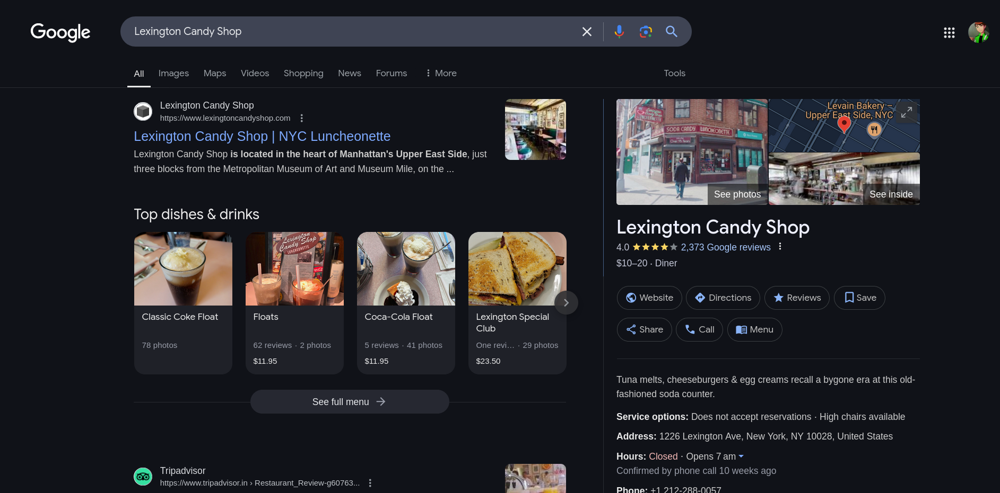
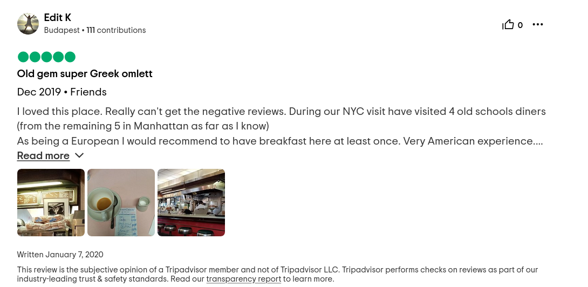

# Old Diner - writeup

My friend once visited this place that served ice cream with coke. He said he had the best Greek omlette of his life and called it a very american experience. Can you find the name of the diner and the amount he paid?

Flag Format: KashiCTF{Name_of_Diner_Amount}

For clarification on the flag format The diner's name is in title case with spaces replaced by underscores. The amount is without currency sign, and in decimal, correct to two decimal places, i.e. KashiCTF{Full_Diner_Name_XX.XX}

---

In this chall i searched for various Diners but got nothing.

After a lot of searching i got to know about `Lexington Candy Shop`

`Lexington Candy Shop` is famous for soda floats (`ice cream with coke` is float: Hint from chall text)

And then I searched reviews for `Lexington Candy Shop` (from [here](https://www.tripadvisor.com/Restaurant_Review-g60763-d522599-Reviews-or60-Lexington_Candy_Shop-New_York_City_New_York.html)) and found a bill, with somewhat similar description in chall text. (of greek omelette)

Review Page - 

Bill page - 

And found total bill to be `41.65`

Hence flag for this chall is - `KashiCTF{Lexington_Candy_Shop_41.65}`