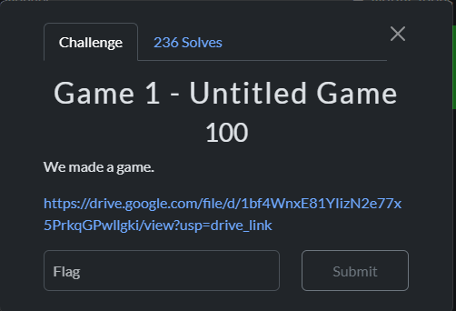
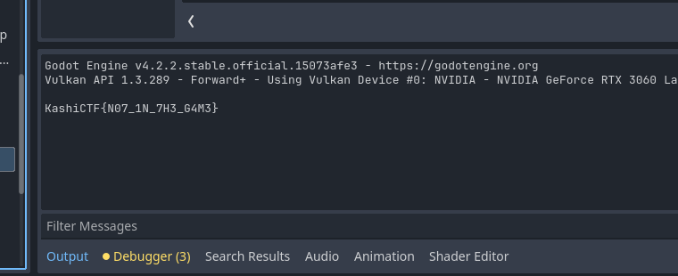

# Solution
We are given a exe which is a game. After exploring in the game, we find a book which has godot written on it which game me the idea that this game is made in godot. 

I used https://github.com/GDRETools/gdsdecomp to decompile the godot game and opened it in Godot Engine 4.2.2.

Running the game from the Godot engine project gives us the flag in output window
