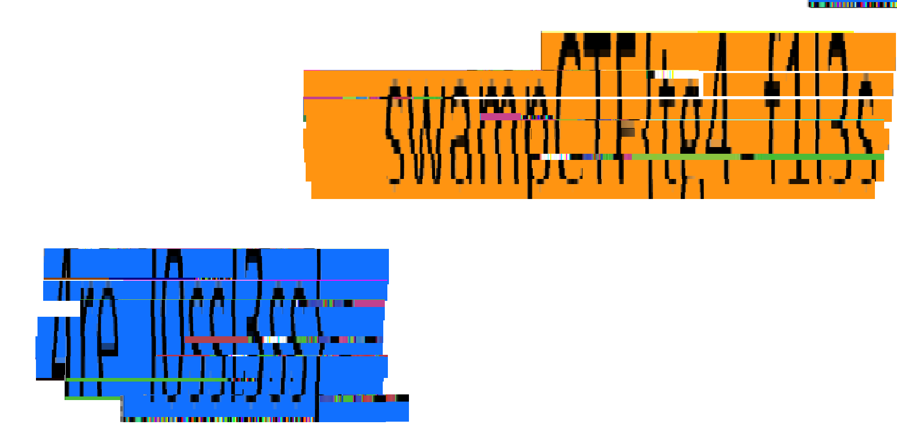

## Read Between .tga Lines

### **Challenge:**

We were given multiple image fragments in the **.tga format**.

### **Solution:**

- **TGA files are lossless**, meaning they can be perfectly reconstructed.
- Using **image editing tools** such as GIMP or Photoshop, I combined the image parts.
- The complete image revealed the flag.



### **Flag:**

```
swampCTF{tg4_f1l3s_4re_l0ssl3ss}
```
