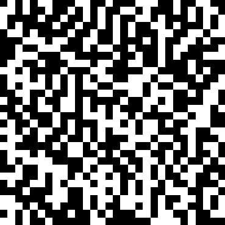

## Code

This was a forensics challenge in TamuCTF2025 



- at first glance this looks like a qr code , but this is 30x30 and we know that qr codes are 37x37 and 41x41 . so i tried fitting this in a qr code but didnt work
- so i searched for more barcodes and this looked like data matrix but it also didnt work
- then i marked all black as 1 and white boxes as 0 but it and wrote a script using opencv
- it didnt work so i tried black as 0 and white as 1 , and now it worked -
```Wow!!!!!!!!! You just got the message and the flag: gigem{b1n4ry_d3c0d1n6_h319y2z8}```
```python
    import cv2
import numpy as np

def image_to_binary(image_path):
    img = cv2.imread(image_path, cv2.IMREAD_GRAYSCALE)
    
    if img is None:
        print("Error: Could not read the image.")
        return
    
    box_size = 30
    expected_size = box_size * 30  
    img = cv2.resize(img, (expected_size, expected_size), interpolation=cv2.INTER_NEAREST)
    rows, cols = 30, 30  
    binary_output = ""
    
    for r in range(rows):
        for c in range(cols):
            block = img[r*box_size:(r+1)*box_size, c*box_size:(c+1)*box_size]
            _, block_bin = cv2.threshold(block, 127, 255, cv2.THRESH_BINARY)
            num_white = np.sum(block_bin == 255)
            num_black = np.sum(block_bin == 0)
            
            binary_output += "1" if num_white > num_black else "0"
        
        binary_output += "\n"  
    return binary_output
image_path = "image.png"  
binary_result = image_to_binary(image_path)
print(binary_result)
```
