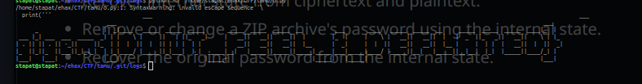

# Deflated
I heard ZipCrypto Store has a vulnerability, so I've used ZipCrypto Deflate instead. Can you still get the flag?

Notes

Flag matches regex gigem{[A-Z0-9_]+}.
Do not try to brute force the password. It is not in any password list.

# solution
- after reading about this challenge i got a tool called bkcrack which exploited this vuln
- using it 
```bash
stapat@stapat:~/ehax/CTF/tamu/deflated$ ./bkcrack -L deflated.zip 
bkcrack 1.7.1 - 2024-12-21
Archive: deflated.zip
Index Encryption Compression CRC32    Uncompressed  Packed size Name
----- ---------- ----------- -------- ------------ ------------ ----------------
    0 ZipCrypto  Deflate     fcd92ad5          500          149 print_flag.py
    1 ZipCrypto  Deflate     967f1426           75           74 .git/COMMIT_EDITMSG
    2 ZipCrypto  Store       576463b5           21           33 .git/HEAD
    3 None       Store       00000000            0            0 .git/branches/
    4 ZipCrypto  Deflate     bb5adcd1          112          102 .git/config
    5 ZipCrypto  Deflate     1f078b37           73           75 .git/description
    6 ZipCrypto  Deflate     d21224f8          145          146 .git/index
    7 None       Store       00000000            0            0 .git/info/
    8 ZipCrypto  Deflate     21cd3d77          240          185 .git/info/exclude
    9 None       Store       00000000            0            0 .git/logs/
   10 ZipCrypto  Deflate     c5d70e9f          364          203 .git/logs/HEAD
   11 None       Store       00000000            0            0 .git/logs/refs/
   12 None       Store       00000000            0            0 .git/logs/refs/heads/
   13 ZipCrypto  Deflate     c5d70e9f          364          203 .git/logs/refs/heads/main
   14 None       Store       00000000            0            0 .git/objects/
   15 None       Store       00000000            0            0 .git/objects/01/
   16 ZipCrypto  Store       3bf59ff7          119          131 .git/objects/01/c525a1a206c1a6dd2f4124b19c60853e16ff3c
   17 None       Store       00000000            0            0 .git/objects/20/
   18 ZipCrypto  Store       047fb968          266          278 .git/objects/20/e03717d7ede63e8c344e97e3451559213844e0
   19 None       Store       00000000            0            0 .git/objects/43/
   20 ZipCrypto  Store       2ad0c039           57           69 .git/objects/43/5e8f8c19faa69d279d18f3862209380fbd710f
   21 None       Store       00000000            0            0 .git/objects/5e/
   22 ZipCrypto  Store       caab86cf          190          202 .git/objects/5e/6304a711c542fb448a368be9270c7aba3ba627
   23 None       Store       00000000            0            0 .git/objects/7d/
   24 ZipCrypto  Store       13d90929           58           70 .git/objects/7d/7cda2c8ffed4caf0f92f956eb2372e7bbd4ed5
   25 None       Store       00000000            0            0 .git/objects/8f/
   26 ZipCrypto  Store       3b720017          155          167 .git/objects/8f/9acad28f3184c2124935c0f55422386d696f6a
   27 None       Store       00000000            0            0 .git/objects/info/
   28 None       Store       00000000            0            0 .git/objects/pack/
   29 None       Store       00000000            0            0 .git/refs/
   30 None       Store       00000000            0            0 .git/refs/heads/
   31 ZipCrypto  Store       efd9b0df           41           53 .git/refs/heads/main
   32 None       Store       00000000            0            0 .git/refs/tags/
```
- we can see a git repo and a print_flag.py . we see that has ZipCrypto and Deflate
- we  need a file which is store and ZipCrypto encrypted and we know atleast 12 bytes of the file
- i am using ```.git/HEAD``` which has starting as ```ref: refs/heads/main``` and stored this in a file
```bash
stapat@stapat:~/ehax/CTF/tamu/deflated$ ./bkcrack -C deflated.zip -c .git/HEAD -p plain2.txt 
bkcrack 1.7.1 - 2024-12-21
[23:22:31] Z reduction using 14 bytes of known plaintext
100.0 % (14 / 14)
[23:22:31] Attack on 511489 Z values at index 6
Keys: f2635bca a91bec3a ec81bdf9
16.7 % (85167 / 511489)
Found a solution. Stopping.
You may resume the attack with the option: --continue-attack 85167
[23:25:09] Keys
f2635bca a91bec3a ec81bdf9
```
- now we got the keys so making a archive with my own password  ```nopass``
```bash
stapat@stapat:~/ehax/CTF/tamu/deflated$ ./bkcrack -C deflated.zip -k f2635bca a91bec3a ec81bdf9 -U nopass.zip nopass
bkcrack 1.7.1 - 2024-12-21
[23:28:46] Writing unlocked archive nopass.zip with password "nopass"
100.0 % (16 / 16)
Wrote unlocked archive.
```
- extracting it gave me my print_flag.py . but it didnt looked like the flag it said dig deeper
- it was a git repo , i saw the previous commit and got the flag in the same file



# flag
```
gigem{dont_feel_2_deflated}
```