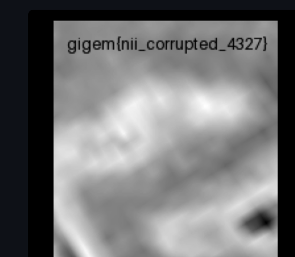

# NII

Can't seem to open the file

# Solution
- we have a nii file which has a corrupted header
- i used nifti_tool for this 
```bash
nifti_tool -disp_hdr -infile flag.nii
** nifti_header_version: bad sizeof_hdr = 0
** flag.nii: bad nifti header version -1
** resetting invalid NIFTI version to 1

N-1 header file 'flag.nii', num_fields = 43

all fields:
  name                offset  nvals  values
  ------------------- ------  -----  ------
  sizeof_hdr             0      1    0
  data_type              4     10    
  db_name               14     18    
  extents               32      1    0
  session_error         36      1    0
  regular               38      1    
  dim_info              39      1    0
  dim                   40      8    3 170 192 193 1 1 1 1
  intent_p1             56      1    0.0
  intent_p2             60      1    0.0
  intent_p3             64      1    0.0
  intent_code           68      1    0
  datatype              70      1    64
  bitpix                72      1    64
  slice_start           74      1    0
  pixdim                76      8    1.0 0.138097 0.138097 0.138097 1.0 1.0 1.0 1.0
  vox_offset           108      1    352.0
  scl_slope            112      1    1.0
  scl_inter            116      1    0.0
  slice_end            120      1    0
  slice_code           122      1    0
  xyzt_units           123      1    0
  cal_max              124      1    0.0
  cal_min              128      1    0.0
  slice_duration       132      1    0.0
  toffset              136      1    0.0
  glmax                140      1    0
  glmin                144      1    0
  descrip              148     80    
  aux_file             228     24    
  qform_code           252      1    0
  sform_code           254      1    2
  quatern_b            256      1    -0.913035
  quatern_c            260      1    -0.241888
  quatern_d            264      1    0.326113
  qoffset_x            268      1    31.133253
  qoffset_y            272      1    13.441433
  qoffset_z            276      1    18.487276
  srow_x               280      4    0.092564 0.057501 -0.084831 31.133253
  srow_y               296      4    0.064495 -0.12152 -0.011995 13.441433
  srow_z               312      4    -0.079643 -0.031579 -0.108308 18.487276
  intent_name          328     16    
  magic                344      4
```
- The size of header(sizeof_hdr) ( first 4 bytes) should be 348, but it's currently 0, so changing it to 348
(https://brainder.org/2012/09/23/the-nifti-file-format/)
```bash
stapat@stapat:~/ehax/CTF/tamu/nii$ xxd flag.nii | head 
00000000: 0000 0000 0000 0000 0000 0000 0000 0000  ................
00000010: 0000 0000 0000 0000 0000 0000 0000 0000  ................
00000020: 0000 0000 0000 0000 0300 aa00 c000 c100  ................
00000030: 0100 0100 0100 0100 0000 0000 0000 0000  ................
00000040: 0000 0000 0000 4000 4000 0000 0000 803f  ......@.@......?
00000050: 4b69 0d3e 4d69 0d3e 4d69 0d3e 0000 803f  Ki.>Mi.>Mi.>...?
00000060: 0000 803f 0000 803f 0000 803f 0000 b043  ...?...?...?...C
00000070: 0000 803f 0000 0000 0000 0000 0000 0000  ...?............
00000080: 0000 0000 0000 0000 0000 0000 0000 0000  ................
00000090: 0000 0000 0000 0000 0000 0000 0000 0000  ................
```
- the header is currently ```0000 0000``` but that should be ```0x15C``` ie 348 in hex , so now modifying the header
```python
with open("flag.nii", "r+b") as f:
    f.seek(0)
    f.write(b'\x5c\x01\x00\x00')  # 348 in little-endian
```
- making a copy of this file with the new header and fixed nii using nifti tools ```nifti_tool -copy_im -prefix fixed.nii -infile flag.nii```
- now our header is fixed in the new  , now we can open this file in matlab or find a online tool to open it
- now we got our flag


# flag 
```
gigem{nii_corrupted_4327}
```